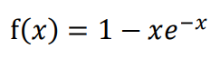

# Gradient Descent

Homework 2

## Environment

* Python 3.7+

## Requirements

* matplotlib (for plot images)

## IDE

* No

## Description

Use gradient descent to find local minimum of function f(𝑥) = 1 − 𝑥𝑒^-𝑥
